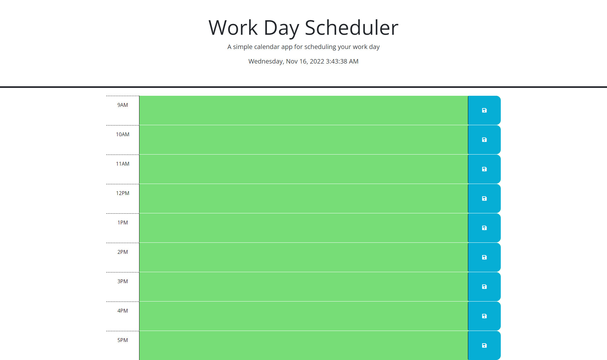

# ScheduleApp

## Description

The Calender App is an interactive calender that lets you schedule events in a typical 9-5 day and have them saved upon page reload when you click the blue save button! Towards the top you can see your local time live by the second, and below you can see section from 9 AM to 5 PM. When times are set in the future, each time section will appear green. When your current time matches a time on the calender, that time section will appear red. When your current time is past certain hours, those hours will appear gray. When a new day begins, all hours will reset to green! Enjoy using this interactive page to plan your day!

## Contents

1. [Deployed Page](#deployed-page)
2. [License](#license)
3. [Credits](#credits)

## Deployed Page

[Deployed Github Page](https://garretta01.github.io/CalenderApp/)

## License

N/A

## Credits

- [The Coding Bootcamp](https://github.com/coding-boot-camp/crispy-octo-meme) for starter code
- Garrett Anderson for JQuery code
